<div align="center">


[](https://git.io/typing-svg)

[](https://kamrul.us)
[](https://linkedin.com/in/kamrulofficial)
[](mailto:Mr.Kamrul61@gmail.com)


</div>

## PROFILE

I am Kamrul Hossain, a technical support and system administration professional based in Bangladesh. I build, secure, troubleshoot, and automate digital infrastructure with a focus on reliability and clear operational outcomes.

My work covers Linux servers, web hosting, cPanel and WHM, DNS, SSL, business email, Cloudflare, web security, application deployment, full-stack development, and AI-assisted automation. I also publish practical tools and technical guides for problems I encounter in real environments.

```text
LOCATION      Bangladesh, UTC+06:00
FOCUS         Technical support, systems, security, automation
AVAILABLE     Remote roles, projects, and open-source collaboration
WORK STYLE    Practical, security-minded, documented, maintainable
```

## CORE CAPABILITIES

| SYSTEMS AND SUPPORT | SECURITY AND NETWORKING |
| --- | --- |
| Linux server administration | Cloudflare configuration and WAF rules |
| cPanel, WHM, and hosting operations | DNS, SSL, domain, and network troubleshooting |
| Monitoring, migration, and incident resolution | Vulnerability assessment and system hardening |
| Business email and delivery troubleshooting | Secure deployment and access configuration |

| DEVELOPMENT | AUTOMATION |
| --- | --- |
| Backend services, APIs, and databases | Python scripting and workflow automation |
| Responsive web applications | AI-assisted tools and chatbots |
| Deployment and production support | Notification and reporting integrations |
| Maintainable technical documentation | Repetitive task and process optimization |

## TECHNOLOGY

<div align="center">


</div>

## LIVE GITHUB OVERVIEW

These cards are generated from my GitHub data and refreshed automatically every six hours.

<div align="center">









</div>

## FEATURED PROJECTS

| PROJECT | PURPOSE | STACK |
| --- | --- | --- |
| [Cloudflare Security Rules](https://github.com/kamrullab/cloudflare-security-rules) | A practical WAF setup guide covering bot protection, country rules, and challenge actions. | Cloudflare, WAF, Security |
| [WHMCS Discord Alert Pro](https://github.com/kamrullab/whmcs-discord-alert-pro) | Detailed WHMCS notifications for Discord with responder and IP information. | PHP, WHMCS, Discord |
| [Windows Auto Update Manager](https://github.com/kamrullab/Windows-Auto-Update-Manager) | A simple utility for controlling automatic updates on Windows systems. | Windows, Batch, Automation |
| [Zoho Mail Guide](https://github.com/kamrullab/Zoho) | A step-by-step custom-domain setup guide for Zoho Mail. | Email, DNS, Zoho |

<div align="center">

[](https://github.com/kamrullab?tab=repositories)

</div>

## PUBLISHED BOOK

<table>
  <tr>
    <td width="190" align="center">
      <a href="https://kamrul.pages.dev/book/">
        
      </a>
    </td>
    <td>
      <strong>AI Prompt Engineering, Bangla Edition</strong><br><br>
      A practical Bangla-language guide to prompt-engineering methods, reusable patterns, best practices, and real-world examples for working effectively with AI tools.<br><br>
      <a href="https://kamrul.pages.dev/book/"><strong>Read the book</strong></a>
    </td>
  </tr>
</table>

## SERVICES

| AREA | DELIVERY |
| --- | --- |
| Technical support | Troubleshooting, customer support, remote assistance, and incident resolution |
| System administration | Linux, hosting, cPanel and WHM, monitoring, migrations, and maintenance |
| Domains and email | DNS, SSL, business email, SMTP, deliverability, Google Workspace, and Zoho Mail |
| Web security | Cloudflare, WAF rules, vulnerability assessment, hardening, and secure configuration |
| Automation | Python scripts, AI workflows, chatbots, notifications, and process automation |
| Web development | Responsive applications, backend integrations, APIs, databases, and deployment |

## CONTACT

For technical support, infrastructure, security, automation, open-source work, or a useful product idea, contact me through any of the channels below.

<div align="center">

[](https://kamrul.us)
[](https://linkedin.com/in/kamrulofficial)
[](https://x.com/elitekamrul)
[](https://facebook.com/elitekamrul)
[](mailto:Mr.Kamrul61@gmail.com)

<br><br>

SECURE SYSTEMS. CLEAR SOLUTIONS. CONTINUOUS IMPROVEMENT.


</div>
